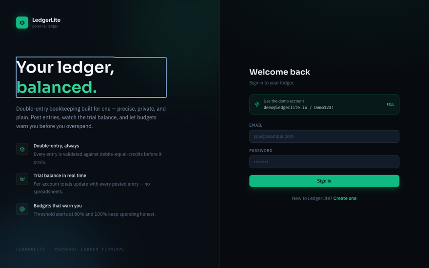
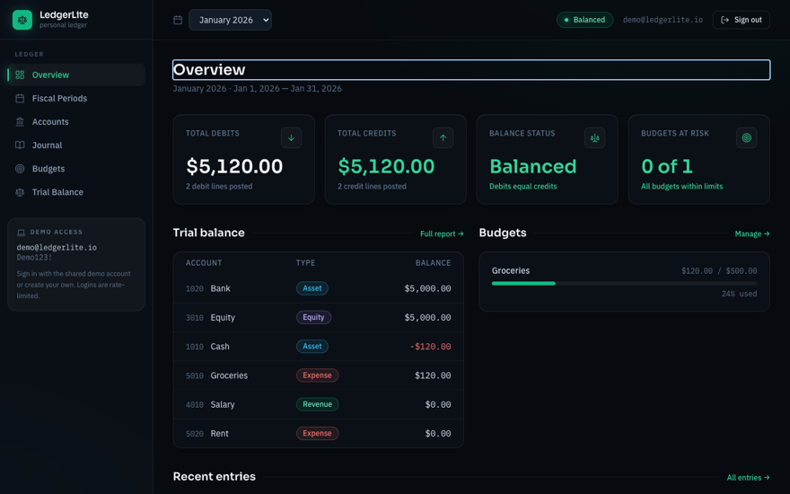
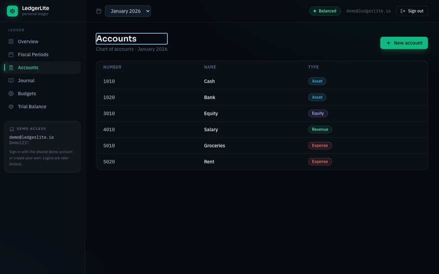
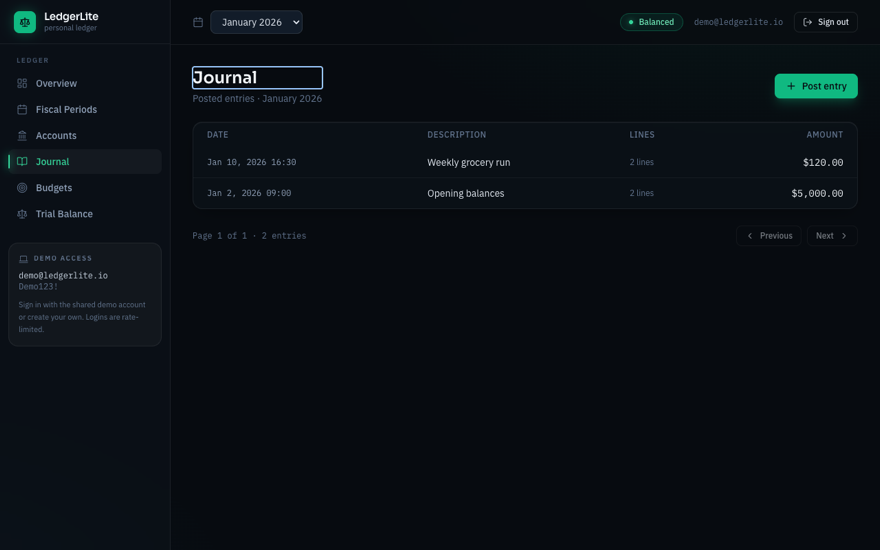
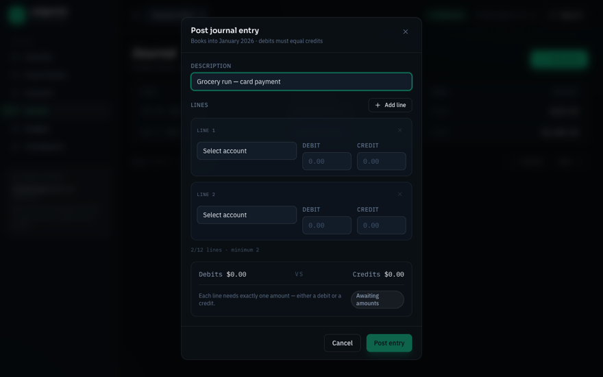
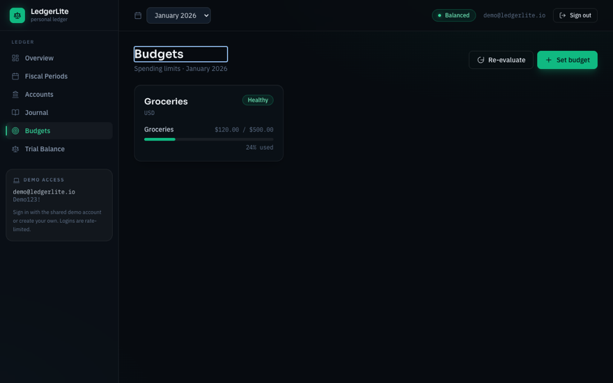
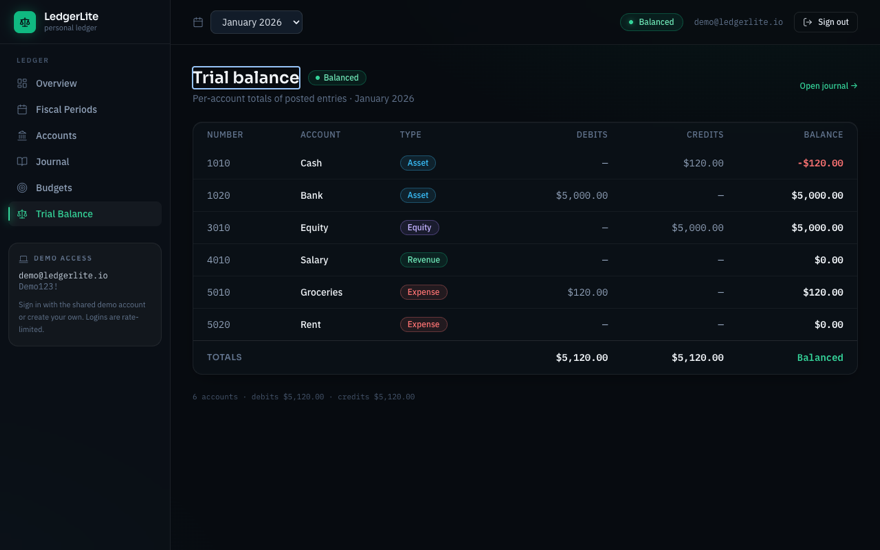
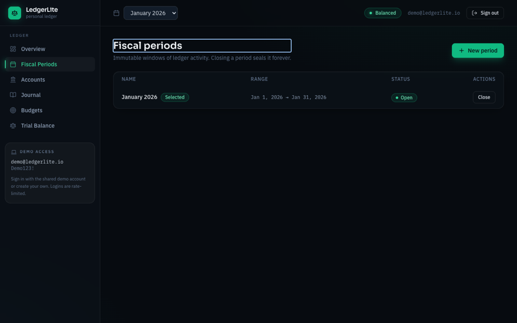
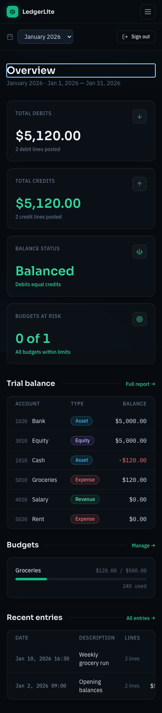

# LedgerLite Web

**The web client for double-entry personal bookkeeping: see every account, enter balanced
journal entries with live feedback, track budgets, and close the books with confidence.**

[](https://learn.microsoft.com/en-us/dotnet/core/whats-new/dotnet-10/overview)
[](https://github.com/Alex5350/ledgerlite-web/actions/workflows/ci.yml)
[](LICENSE)

> **Two ways to read this page.** Not an engineer? Everything below the pictures stays in plain
> language, and jargon links to the [glossary](docs/GLOSSARY.md). Engineer? The deep dive lives
> in [TECHNICAL.md](TECHNICAL.md): architecture, request flow, and every major decision mapped
> back to the business problem it solves.

## The problem

Some people keep their own books: a freelancer splitting business and personal costs, a
household running on real accounting instead of a shoebox of receipts. The discipline that
keeps such books honest is [double-entry](docs/GLOSSARY.md): every transaction is written as a
[journal entry](docs/GLOSSARY.md) whose debits and credits must add up to the same amount, so
money cannot appear from nowhere or vanish without a trace. The
[LedgerLite API](https://github.com/Alex5350/ledgerlite) is the server half of that idea: it
holds the rules and refuses to store anything that breaks them. This repository is the other
half, the web client that makes those rules pleasant to live with.

Bookkeeping interfaces usually get this backwards: they make it easy to type something
unbalanced and hard to notice. Two columns labeled Debit and Credit will accept anything, the
mistake surfaces weeks later in a trial balance that does not add up, and by then the culprit
is buried in a hundred posted entries. LedgerLite Web makes the balancing visible while you
type: the journal editor keeps a running total of both sides and refuses to submit until they
match. Closed periods stay genuinely closed: once a period is locked, no screen in this client
offers a way to post into it.

## The product in pictures

| Sign in | The period at a glance |
|:---:|:---:|
|  |  |

Sign in (a one-click chip fills the demo credentials) and land on the Overview: total debits
and credits for the period, whether the books balance, budgets at risk, budget bars and the
latest entries, all on one screen.

| The chart of accounts | The posted journal |
|:---:|:---:|
|  |  |

Every account in the period's chart, with type badges so assets, equity, revenue and expenses
read at a glance; and the journal of posted entries, paged, with the entry editor one click
away.

| Post an entry only when it balances | Budgets with threshold warnings |
|:---:|:---:|
|  |  |

The core of the product: as you type lines, the editor shows running debit and credit totals
with a *Balanced / Out of balance* pill, and the Post button stays disabled until the two
sides match. Budgets show spending against each limit, turning amber at 80% and red at 100%.

| The trial balance | Fiscal periods |
|:---:|:---:|
|  |  |

The classic check: every account's debits and credits side by side, with totals and a
Balanced badge when they match. Periods open for posting and close for good; closing comes
with an explicit warning that the period becomes immutable.

<p align="center"></p>

The same interface reflows for a phone: the sidebar collapses behind a hamburger and every
page stays usable on a small screen.

## What it delivers

- **Entries that cannot be posted unbalanced.** The journal editor keeps running debit and
  credit totals, shows a Balanced / Out of balance indicator, and gates the submit button
  until the two sides match; the API re-checks every entry server-side before storing it.
- **A period overview you can trust.** Totals, balance status, budgets at risk, a
  trial-balance excerpt and the latest entries on one screen, for whichever fiscal period you
  select in the top bar.
- **Budgets that warn before they break.** Each budget tracks spending against its limit;
  the bar turns amber at 80% and red at 100%, and the same thresholds drive the at-risk
  count on the Overview.
- **Periods that stay closed.** Closing a fiscal period is an explicit, warned action, and a
  closed period refuses new postings.
- **Errors where you can act on them.** When the API rejects something, the message appears
  next to the field or as a toast, in plain words, not as a raw error page.
- **One consistent design, desktop to phone.** A single hand-built design system drives every
  page, and the layout adapts to small screens.

## How the engineering solves it

Plain-terms bridge; each item links to the full story in [TECHNICAL.md](TECHNICAL.md).

- **The balancing must be visible while typing, but the screen itself must not be trusted.**
  The editor computes running totals in the page for instant feedback, and the same entry is
  re-validated by the API's domain rules on the server before it is stored: the interface
  cannot bypass the rulebook.
  ([validation in two places](TECHNICAL.md#how-the-tech-solves-the-business-problem))
- **The first page should arrive instantly, yet the editor must react to every keystroke.**
  Pages are first delivered as plain rendered HTML, then become interactive in place; on later
  visits the app already runs in the browser, so the first visit never waits on a full
  application download. ([Interactive Auto](TECHNICAL.md#how-the-tech-solves-the-business-problem))
- **One person's session must never disturb another's.** Every signed-in session owns its own
  connection chain to the API, so closing one tab cannot break the connections of the others;
  this was found and fixed by driving the real app in a browser.
  ([per-circuit scoping](TECHNICAL.md#how-the-tech-solves-the-business-problem))
- **The interface's look must mean something, not just decorate.** The design system is code:
  a budget bar component knows the amber and red thresholds, a field knows how to show a
  validation error, and every page inherits that behavior instead of restating it.
  ([custom UI kit](TECHNICAL.md#how-the-tech-solves-the-business-problem))

## Why this project exists

LedgerLite Web is the front half of a personal reference application: a deliberate,
self-contained exercise in building a production-shaped web client against a real API. The
product value comes first: a person keeping honest books gets an interface where the
accounting rules are visible and enforced while the work happens, not discovered at audit
time. The learning exercise is genuine too: one component library running in two hosting
models, authentication wired end to end, a hand-built component kit instead of a stock one,
and tests at every layer. The project pairs with the
[LedgerLite API](https://github.com/Alex5350/ledgerlite) so the two repositories together form
a full-stack solution; the backend is included here unchanged for a clone-and-run experience,
with its own documentation and history upstream.

<details>
<summary><b>For developers: quickstart</b></summary>

You need the [.NET 10 SDK](https://dotnet.microsoft.com/download/dotnet/10.0). Nothing else;
the backend uses SQLite and seeds demo data on first run.

```bash
git clone https://github.com/Alex5350/ledgerlite-web.git
cd ledgerlite-web

# 1. Start the API (terminal 1) - seeds demo data, serves http://localhost:5080
dotnet run --project src/LedgerLite.Api

# 2. Start the UI (terminal 2) - http://localhost:5010
dotnet run --project src/LedgerLite.Web
```

Sign in with the seeded demo account: **`demo@ledgerlite.io` / `Demo123!`** (or create your
own). The login page has a one-click chip that fills the demo credentials. You should land on
the Overview dashboard with the seeded "January 2026" period already selected.

<details>
<summary><strong>Troubleshooting</strong></summary>

- **"Could not reach the LedgerLite API"** - start the API (terminal 1) before using the UI;
  the message also appears if the API crashed. The UI expects it at `http://localhost:5080`
  (`Api:BaseUrl` in `src/LedgerLite.Web/appsettings.json`).
- **"Too many requests" on login** - logins are rate-limited to 5 per minute per IP on the
  API side. Wait a minute and try again.
- **Ports in use** - the API defaults to 5080 and the UI to 5010. Override with
  `ASPNETCORE_URLS` (and `Api__BaseUrl` for where the UI finds the API); both are also
  configurable in `appsettings.json`.
- **Styles changed but nothing happened** - the compiled stylesheet is a build artifact:
  run `npm run build:css` (see below).

</details>

### One-time Tailwind setup (optional)

The compiled stylesheet (`src/LedgerLite.Web/wwwroot/app.css`) is committed, so UI development
works without Node. To change styles in `tailwind.css` and recompile:

```bash
npm install        # once
npm run build:css  # or: npm run watch:css
```

Docker and CI notes for the whole solution live in
[TECHNICAL.md](TECHNICAL.md#security-and-operations).

</details>

## The application

| Page | What you do there |
|---|---|
| **Overview** | See the period at a glance: debits, credits, balance status, budgets at risk, budget bars, recent entries |
| **Fiscal Periods** | Create periods, close them (with an immutability warning), see status badges |
| **Accounts** | Manage the chart of accounts per period with type-toned badges; duplicate-number conflicts surface as inline field errors |
| **Journal** | Browse paged entries; post new ones in the live-balance editor gated on debits equaling credits |
| **Budgets** | Watch spending progress bars that turn amber at 80% and red at 100%, with threshold badges and re-evaluation |
| **Trial Balance** | Read the full report with totals and a balanced indicator |

Every change flows through the API's validation; when something is wrong, the rejection is
rendered where you can act on it, inline next to the field or as a toast.

## Documentation

| Document | What it covers | Audience |
|---|---|---|
| [TECHNICAL.md](TECHNICAL.md) | Architecture, request flow, decisions mapped to business problems, stack rationale, testing | Engineers |
| [docs/GLOSSARY.md](docs/GLOSSARY.md) | Every term this repo uses, in plain English and precisely | Everyone |
| [docs/process.md](docs/process.md) | The build order, phase by phase, matched to the commit history | Engineers |
| [CONTRIBUTING.md](CONTRIBUTING.md) | Ground rules for changes: zero warnings, rules in the domain, tests as part of the change | Developers |

## License

[MIT](LICENSE)
