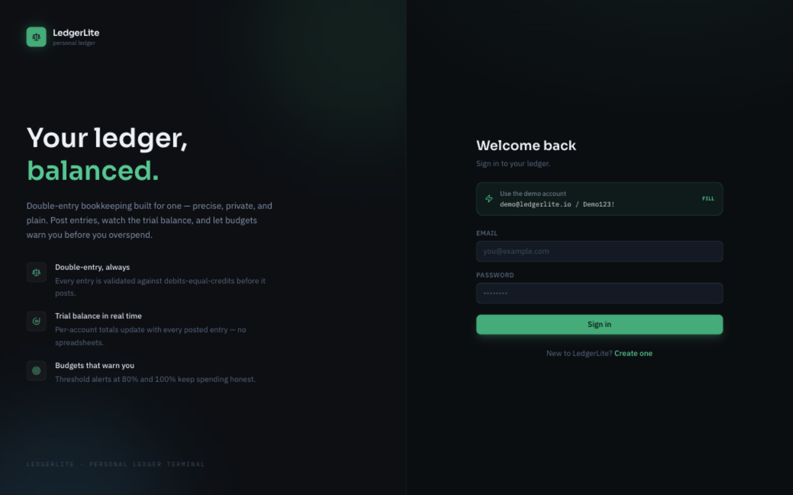
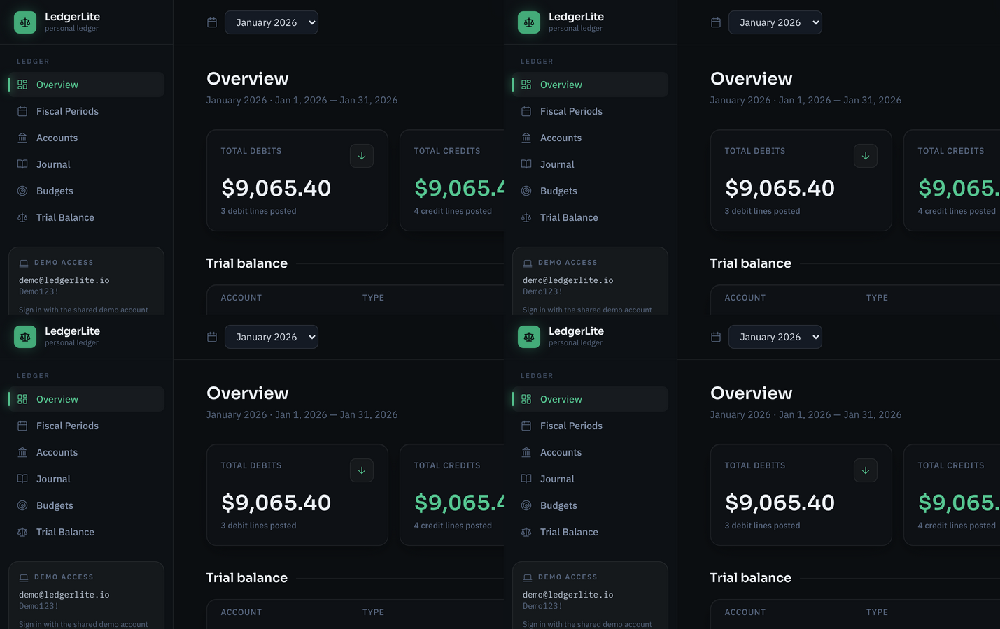
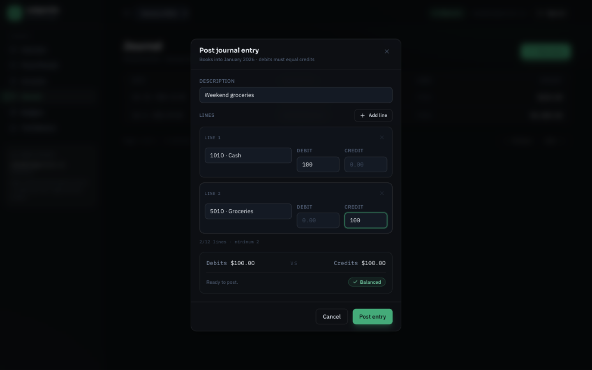
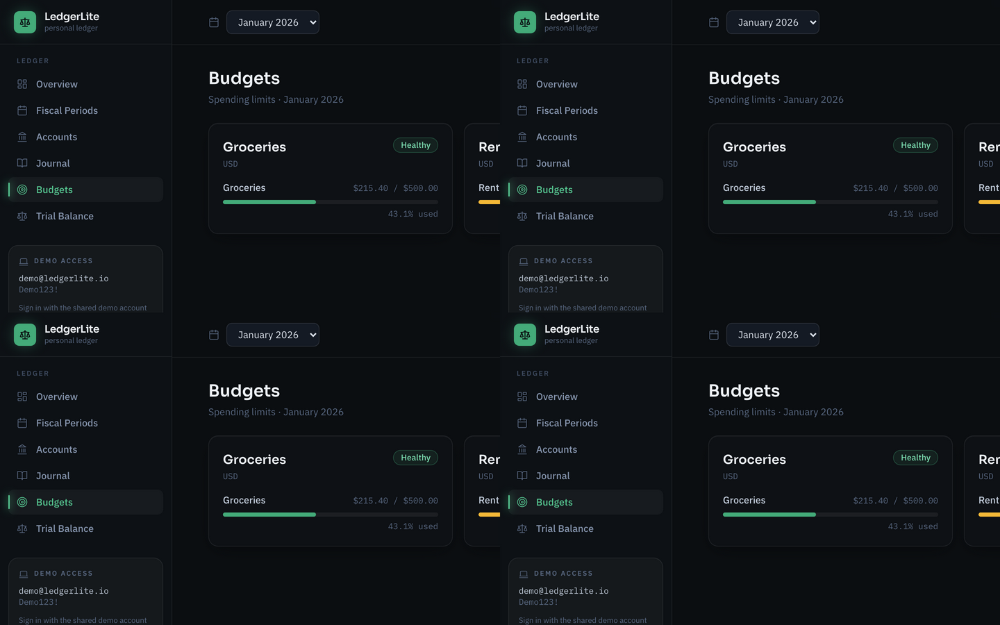

# LedgerLite Web

[](https://learn.microsoft.com/en-us/dotnet/core/whats-new/dotnet-10/overview)
[](https://learn.microsoft.com/en-us/aspnet/core/blazor/)
[](https://tailwindcss.com)
[](LICENSE)

A modern Blazor front-end for the [LedgerLite API](https://github.com/Alex5350/ledgerlite): a
double-entry personal ledger with budgets, fiscal periods and a trial balance - built with a
**hand-crafted Tailwind design system** instead of a stock component kit.

| Login | Overview |
|:---:|:---:|
|  |  |

| Post an entry (live balance check) | Budgets |
|:---:|:---:|
|  |  |

## Why this project exists

LedgerLite Web is a **personal reference application** - a deliberate, self-contained
exercise in building a production-shaped Blazor front-end against a real API: Interactive
Auto across both hosting models, a hand-built component kit instead of a third-party one,
JWT authentication wired end to end, and tests at every layer. It pairs with the
[LedgerLite API](https://github.com/Alex5350/ledgerlite) so the two repositories together
form a full-stack .NET 10 solution; the backend is included here unchanged for a
clone-and-run experience.

## What this project demonstrates

- **Blazor Web App with Interactive Auto render mode** - pages render as static SSR, then go
  interactive over SignalR (Server) and switch to **WebAssembly** on subsequent visits. Both
  hosting models share one component library; the app works in both (the CORS configuration and
  per-circuit HTTP handler chain exist precisely *because* both are exercised).
- **A custom UI component library** - no MudBlazor/Telerik/SwiftUI-style kit: `Button`, `Modal`,
  validated `Field`/`SelectField`, a generic `DataTable<TItem>`, `StatCard`, toasts, skeleton
  loaders, empty states and a threshold-aware `BudgetBar`, all built with `RenderFragment`,
  `EventCallback` and generic type parameters.
- **JWT authentication in Blazor** - a custom `AuthenticationStateProvider` that parses token
  claims without a JWT library, a localStorage-backed token store safe during prerender, a
  `DelegatingHandler` that attaches bearer tokens, and router-level authorization with
  redirect-to-login.
- **Correct service lifetimes for interactive components** - the API client's handler chain is
  scoped per circuit (a `DelegatingHandler` disposes its inner handler, so sharing a primary
  handler across scopes breaks circuits - found and fixed during live browser testing).
- **Tailwind CSS v4 as a design system** - design tokens (`@theme`) for the ink/emerald palette
  and Sora / IBM Plex type stack, with the compiled stylesheet committed so running the app
  needs **no Node.js**.

## Getting started

You need the [.NET 10 SDK](https://dotnet.microsoft.com/download/dotnet/10.0). Nothing else -
the backend uses SQLite and seeds demo data on first run.

```bash
git clone https://github.com/Alex5350/ledgerlite-web.git
cd ledgerlite-web

# 1. Start the API (terminal 1) - seeds demo data, serves http://localhost:5080
dotnet run --project src/LedgerLite.Api

# 2. Start the UI (terminal 2) - http://localhost:5010
dotnet run --project src/LedgerLite.Web
```

Sign in with the seeded demo account: **`demo@ledgerlite.io` / `Demo123!`** (or create your own).
The login page has a one-click chip that fills the demo credentials. You should land on the
Overview dashboard with the seeded "January 2026" period already selected.

### Docker

The root `Dockerfile` builds the **backend API** container (the imported LedgerLite
API - see its [repository](https://github.com/Alex5350/ledgerlite) for deployment notes).
The Blazor UI is intended for `dotnet run` during development:

```bash
docker build -t ledgerlite-api . && docker run -p 5080:8080 ledgerlite-api
```

<details>
<summary><strong>Troubleshooting</strong></summary>

- **"Could not reach the LedgerLite API"** - start the API (terminal 1) before using the UI;
  the message also appears if the API crashed. The UI expects it at `http://localhost:5080`
  (`Api:BaseUrl` in `src/LedgerLite.Web/appsettings.json`).
- **"Too many requests" on login** - logins are rate-limited to 5 per minute per IP on the
  API side. Wait a minute and try again.
- **Ports in use** - the API defaults to 5080 and the UI to 5010. Override with
  `ASPNETCORE_URLS` (and `Api__BaseUrl` for where the UI finds the API); both are also
  configurable in `appsettings.json`.
- **Styles changed but nothing happened** - the compiled stylesheet is a build artifact:
  run `npm run build:css` (see below).

</details>

> The backend is the LedgerLite REST API - DDD/Clean Architecture, JWT-secured minimal APIs,
> 262 backend tests. Its full documentation and history live at
> [Alex5350/ledgerlite](https://github.com/Alex5350/ledgerlite); it is included in this
> repository unchanged so one clone runs everything.

### One-time Tailwind setup (optional)

The compiled stylesheet (`src/LedgerLite.Web/wwwroot/app.css`) is committed, so UI development
works without Node. To change styles in `tailwind.css` and recompile:

```bash
npm install        # once
npm run build:css  # or: npm run watch:css
```

## The application

| Page | What it does |
|---|---|
| **Overview** | Stat cards (debits, credits, balance status, budgets at risk), top accounts, budget bars, recent entries |
| **Fiscal Periods** | Create periods, close them (with an immutability warning), status badges |
| **Accounts** | Chart of accounts per period with type-toned badges; duplicate-number conflicts surface as inline field errors |
| **Journal** | Paged entries; the post-entry modal has a **live balance editor** - running debit/credit totals with a *Balanced / Out of balance* pill, submit gated until debits equal credits |
| **Budgets** | Spending progress bars that turn amber at 80% and red at 100%, threshold badges, re-evaluation |
| **Trial Balance** | Full report with totals and a balanced indicator |

Every mutation flows through the API's domain validation - domain errors (RFC 9457
ProblemDetails) are parsed into `ApiException` and rendered inline or as toasts.

## Architecture

```
src/
├── LedgerLite.Web/            # Blazor server host: SSR + Interactive Server + WASM boot
├── LedgerLite.Web.Client/     # Components, pages, UI kit, API client, auth  (runs in BOTH
│   ├── Pages/                 #   render modes - this is the Interactive Auto payload)
│   ├── Ui/                    #   hand-built component library + PeriodState + toasts
│   ├── Services/Api/          #   typed ILedgerLiteApiClient, DTOs, ApiException
│   ├── Services/Auth/         #   JWT state provider, token store, bearer handler
│   └── wwwroot/               #   appsettings + compiled Tailwind stylesheet
├── LedgerLite.Api/            # ── the backend (imported unchanged) ──
├── LedgerLite.Application/    #   DDD/Clean Architecture, CQRS + ErrorOr
├── LedgerLite.Domain/         #   double-entry ledger domain model
└── LedgerLite.Infrastructure/ #   EF Core + SQLite, JWT, channels
tests/
├── LedgerLite.Web.Tests/              # 119 tests: bUnit components + service units
├── LedgerLite.Domain.UnitTests/       # ── backend suites (262 tests) ──
├── LedgerLite.Application.UnitTests/
└── LedgerLite.Api.IntegrationTests/
```

The build order and every commit are documented in [docs/process.md](docs/process.md).

## Testing

```bash
dotnet test          # 381 tests total, no setup required
```

The **119 Web tests** cover both layers of the front-end:

- **bUnit component tests** - every UI kit component (button variants, loading states, budget
  threshold tones, field validation, generic table, modal visibility, toast lifecycle) plus page
  behavior: the login flow (calls `IAuthService` with the entered values, renders `AuthResult`
  errors), and the journal editor's live-balance gating (post disabled until debits equal
  credits).
- **Service unit tests** - JWT claims/expiry parsing in `JwtAuthenticationStateProvider`,
  `ApiException` error precedence, `PeriodState` selection/retry semantics (including the
  faulted-task retry bug the tests caught), and toast queuing.

Mocks are provided by a shared `AppTestContext` (NSubstitute + cascading authentication state).

## Tech stack

- **Blazor Web App** (.NET 10) - Interactive Auto (Server + WebAssembly), static SSR, router-level auth
- **Tailwind CSS v4** design tokens + hand-built component library (no UI kit dependency)
- **bUnit** 1.40, **xUnit v3**, **NSubstitute**
- Backend: ASP.NET Core minimal APIs, EF Core 10 + SQLite, Serilog - see the
  [API repository](https://github.com/Alex5350/ledgerlite)

## License

[MIT](LICENSE)
